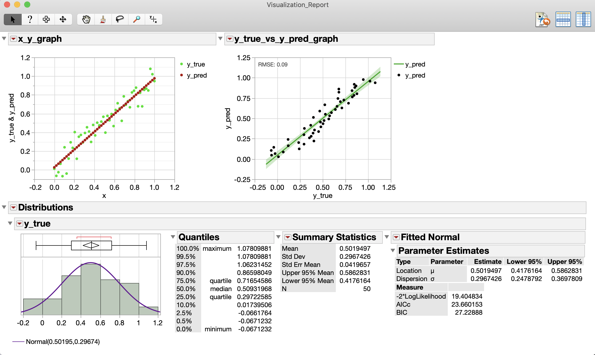

# JMP to python Example
Simple example showing efficient framework for using JMP to execute python &amp; visualize in JMP

## Setup Details
The scripts were built using JMP 14 and Python 3.6

The .jsl file [JMP_to_python_Example.jsl](fetch_python_executable_path.jsl) contains the variable "python_executable" which tells JMP where your python executable is stored. For mac, it tries to look in the two locations people typically install anaconda 3 to. For windows using "python" should work fine, though I haven't tested it on any other windows systems except my own remote desktop.

## Using the Example:
There are 2 ways you can use this example:

1. Install the add-in [JMP_to_python_Example.jmpaddin](JMP_to_python_Example.jmpaddin) and run by going to your JMP add-in drop-down menu
2. Open the [JMP_to_Python_Example_v1_Main_Script.jsl](JMP_to_Python_Example_v1_Main_Script.jsl) script and press run.

The add-in let's you see a the final package works once you compile everything into a self-contained add-in.

## Overview
Here, we will go over the basic flow of the [JMP_to_Python_Example_v1_Main_Script.jsl](JMP_to_Python_Example_v1_Main_Script.jsl) script.

The script starts by prompting the user to specify whether or not they want to load the data after compiling, since sometimes you don't really want to view the data you've processed/compiled right away.

After this, you select a folder where you'll save a copy of your compiled data with a time stamp prefix attached (automatically created)

Next, the code makes some default paths that you pass into the python script you're executing. It makes some assumptions about the nomenclatureJMP_to_python_Example used when python saves a file. You can see the details in the [Build_python_paths.jsl](Build_python_paths.jsl) script.

Following this, the script fetches the python executable python, as mentioned above in the Setup Details section.

Finally, we run the python script using JMPs "run program" function. We specify the python executable path, the path for the python file/script, and some sys.argv parameters that we want python to use (in this example we just pass in some of the file path information specified in JMP).

I have experimented with JMPs recommended method for running python through JMP ([outlined here]( https://www.jmp.com/support/help/14-2/python-interface.shtml#)) and it is quite prone to bugs and really limits what you can actually do with python. The most notable errors I've encountered are (1) JMP crashing when I try to use SciKit Learn, and (2) JMP crashing when I try to use TensorFlow. It should be noted that the "run program" method will throw an error if you try to import matploblib in your python code, though it won't crash JMP.

After your python script executes, the JMP script opens the file that was saved in the "Temp" folder. Next this loaded data table is concatenated with a "Default_Columns_dt" which is basically a data table with the same, or some of the same, column names as your loaded data table, but which has the data types (character, categorical, etc.) hard-coded. This basically forces your loaded data table to adhere to some default data type format you'd like to use when build graphs and such.

Finally, we build our visualization report. Here, we just build a simple report window with 2 xy graphs and 1 histogram with a normal distribution fit. This part of the script is mostly just to show how you could combine multiple default graphs into one interactive window to let you do some sophisticated data exploration.

Below is a snapshot of the example report

Feel free to contact me if you have any questions.
john_t_leonard@apple.com

